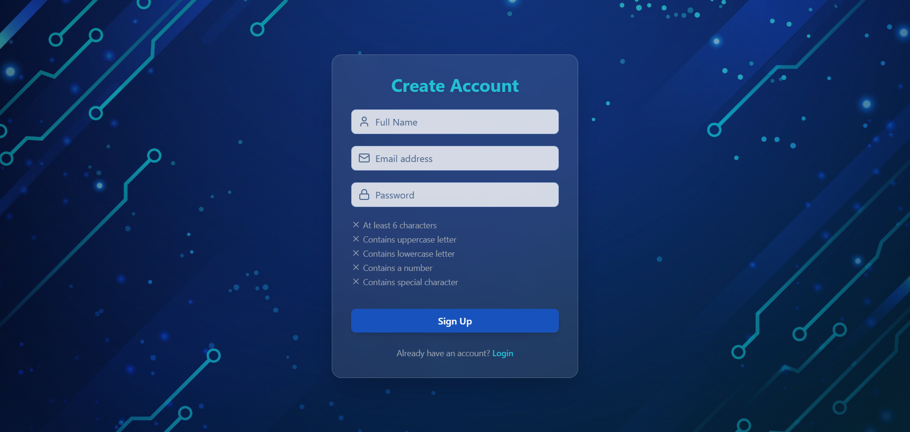
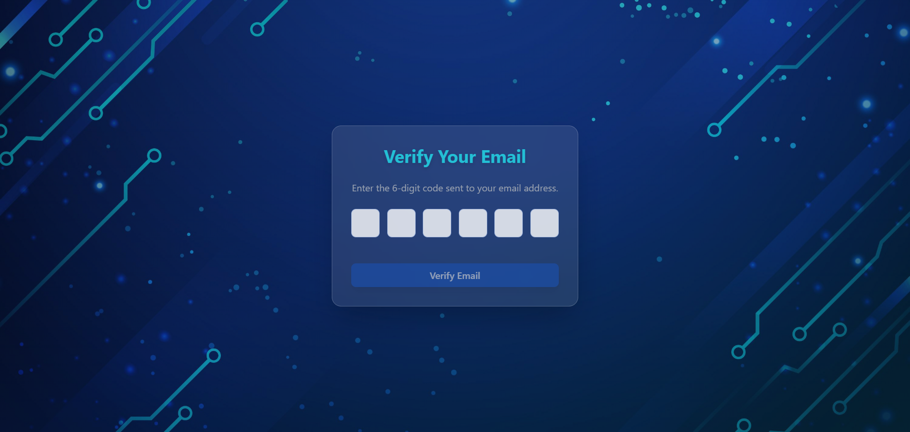
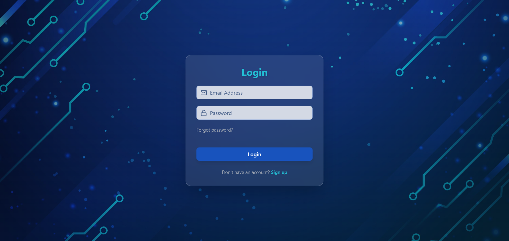
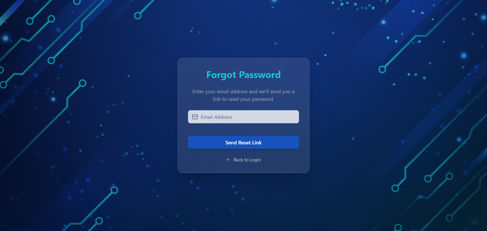
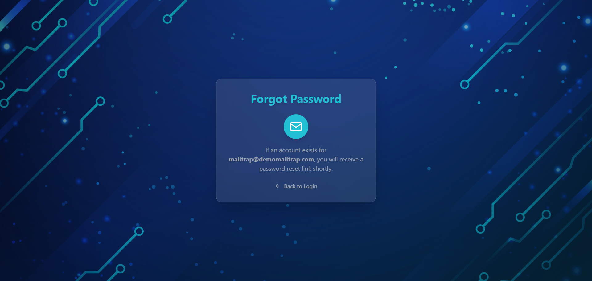
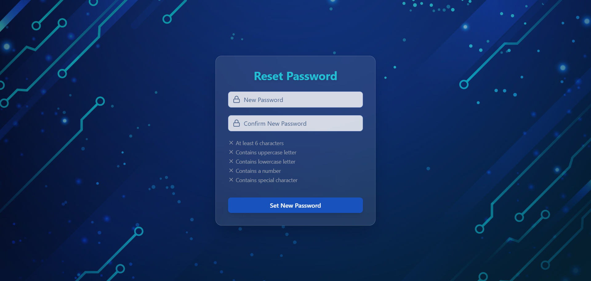
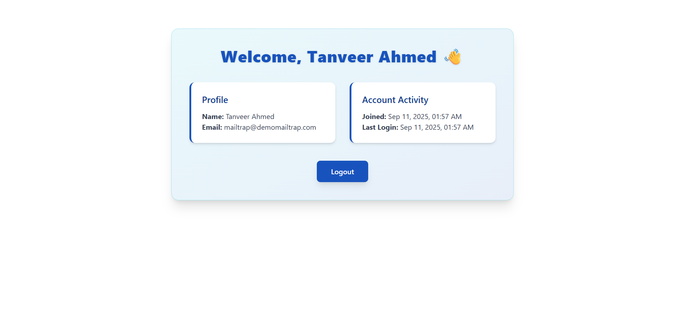
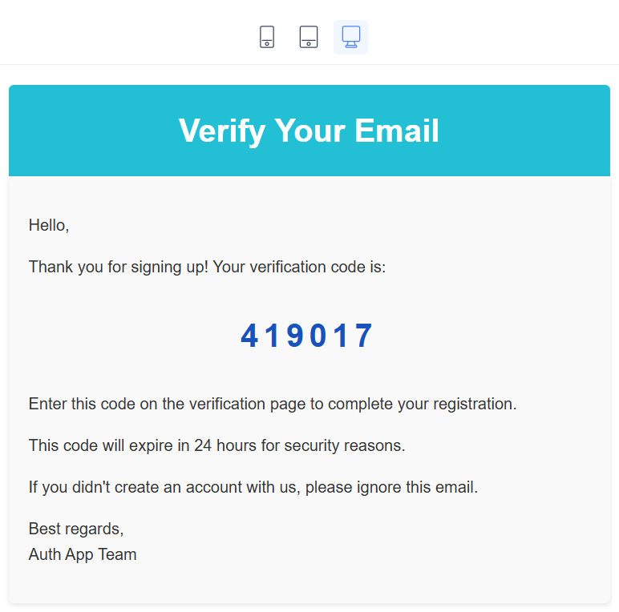
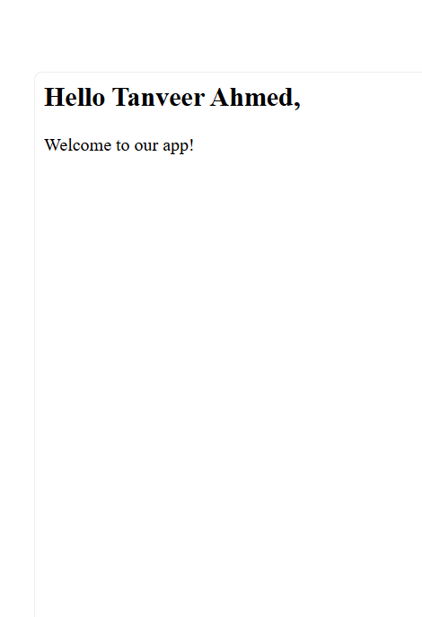
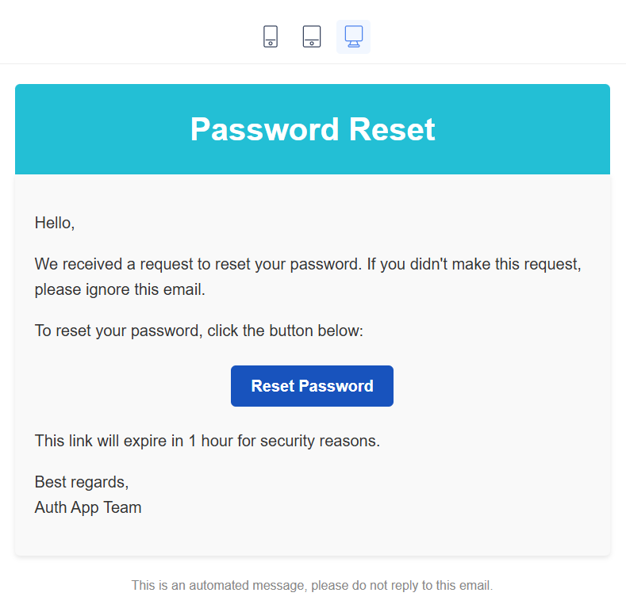

# 🔐 Authentication MERN Stack


---

📂 **GitHub Repository**: [https://github.com/tanveera2001/authentication-mern-stack](https://github.com/tanveera2001/authentication-mern-stack)

A **full-stack authentication system** built with the **MERN stack**. Includes **secure signup, email verification, login, forgot/reset password, protected dashboard, and logout functionality**.  

---

## 📑 Table of Contents

- [🚀 Features](#-features)
- [📝 Problems & Solutions](#-problems--solutions)
- [🛠 Tech Stack](#-tech-stack)
- [📸 Screenshots](#-screenshots)
- [⚙️ Installation & Setup](#installation-and-setup)
- [📡 API Endpoints](#-api-endpoints)
- [📌 Future Improvements](#-future-improvements)
- [👤 Author](#-author)

---

## 🚀 Features  

- 👤 **Sign Up** – Create account with name, email, and secure password validation  
- ✉️ **Email Verification** – 6-digit OTP code sent to user’s email (via Mailtrap for testing)  
- 🔑 **Login** – Access with email & password  
- 🔒 **Protected Dashboard** – Only accessible after login, showing profile & account activity  
- 🔄 **Forgot & Reset Password** – Reset password via email link  
- 🚪 **Logout** – End session securely  
- 📱 **Responsive Design** – Works on desktop, tablet, and mobile  

---

## 📝 Problems & Solutions  

1. **Problem:** When loading the dashboard, it showed a **white screen**.  
   **Solution:** Solved it by **normalizing the user** in both the **frontend (authStore)** and **backend (authController)** so that user data was always consistent and available before rendering.  

2. **Problem:** Password validation wasn’t working consistently.  
   **Solution:** Added **password rules (minLength, uppercase, lowercase, number, special char)** and real-time feedback for the user.  

3. **Problem:** Email verification input was tricky for UX.  
   **Solution:** Used **auto-focus navigation** between 6 OTP fields, plus **paste support** for the code.  

4. **Problem:** Reset password flow sometimes failed with expired tokens.  
   **Solution:** Implemented **token validation and expiry check** in backend, showing user-friendly errors.  
---

## 🛠 Tech Stack  

| Stack | Technologies |
| :-- | :-- |
| **Frontend** |      |
| **Backend / API** |    |
| **Database** |  |
| **Email / Communication** |  |
| **Deployment / Hosting** | Local Development (future plan: Vercel) |

---

## 📸 Screenshots  

**Sign Up Page:**  
  

**Email Verification:**  
  

**Login Page:**  
  

**Forgot Password:**  
  


**Reset Password:**  
  

**Dashboard:**  
  

**Emails:**  
  
  
  


---

## ⚙️ Installation and Setup

1. **Clone the repo**

    ```bash
    git clone https://github.com/tanveera2001/authentication-mern-stack.git
    cd authentication-mern-stack
    ```
2. **Set up environment variables**
   ```bash
    SERVER_PORT=500
    MONGODB_ATLAS_URL=your_mongodb_connection_string_he
    FRONTEND_URL=http://localhost:5173
    SENDGRID_API_KEY=your_sendgrid_api_key_here
    PORTFOLIO_EMAIL_TO=your-email@example.com
    PORTFOLIO_EMAIL_FROM=from-email@example.com
   ```

3. **Install dependencies**

   - **Backend:**  
     Go to the **frontend** folder and run:
     ```bash
     npm install
     ```
     
   - **Frontend:**  
     Go to the **backend** folder and run:
     ```bash
     npm install
     ```

4. **Run the development server**

   - **Backend:**  
    In the **backend** folder, run:
     ```bash
     npm run dev
     ```
     
   - **Frontend:**  
     In the frontend folder, run:
     ```bash
     npm run dev
     ```


5. Open the app in your browser at:

    ```
    http://localhost:5173
    ```

---


## 📡 API Endpoints  

| Method | Endpoint                  | Description |
| ------ | ------------------------- | ----------- |
| POST   | /api/auth/signup          | Register new user |
| POST   | /api/auth/verify-email    | Verify email with 6-digit code |
| POST   | /api/auth/login           | Login user |
| POST   | /api/auth/logout          | Logout user |
| POST   | /api/auth/forgot-password | Send reset link |
| POST   | /api/auth/reset-password/:token | Reset user password |
| GET    | /api/auth/check-auth      | Check if user is authenticated |

---

## 📌 Future Improvements  

- ✅ Add **Google OAuth / Social Login**  
- ✅ Role-based authentication (Admin, User)  
- ✅ Add Refresh Token system  
- ✅ Implement 2FA (Two-Factor Authentication)  

---

## 👤 Author  

**[Tanveer Ahmed]**

- 📧 Email: [tanveera2001@gmail.com](mailto:tanveera2001@gmail.com)  
- 💼 LinkedIn: [https://www.linkedin.com/in/tanveerahmed22/](https://www.linkedin.com/in/tanveerahmed22/)  
- 💻 GitHub: [https://github.com/tanveera2001](https://github.com/tanveera2001)  
